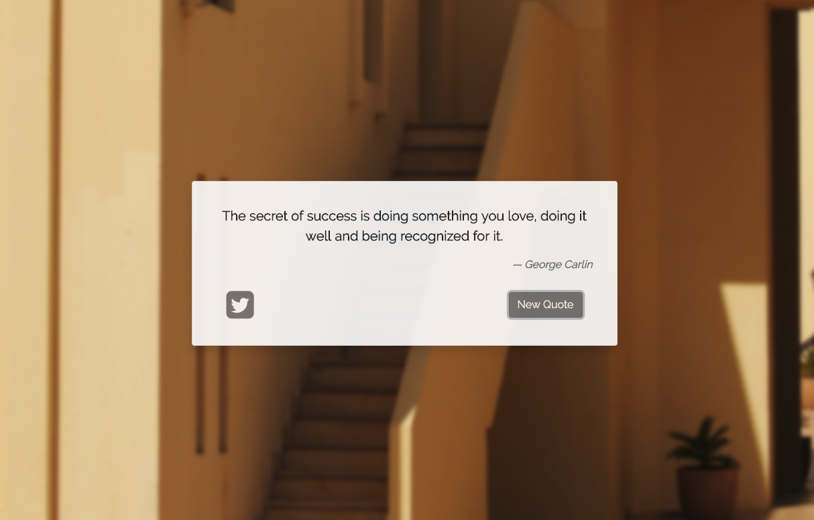
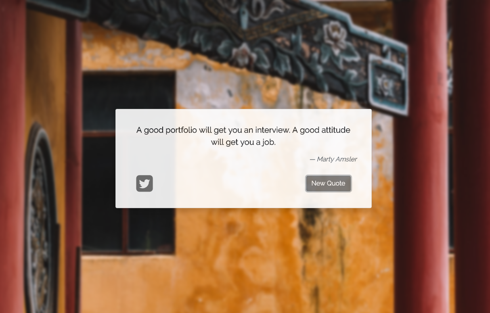

<h1 align="center">Random Quote Machine</h1>

Generates a random quote and a random background image

## Table of Contents
* [Project Status](#project-status)
* [Features](#features)
* [Screenshots](#screenshots)
* [Technologies](#technologies)
* [Inspirations](#inspirations)
* [Contact](#contact)
* [License](#license)

## Project Status
This project is currently: _In Progress_

## Features
Complete:
- [X] Generate a random quote and background image when the "New Quote" button is clicked
- [X] Users can tweet the quote by clicking the Twitter icon button
- [X] Refactor code to utilize vanilla JavaScript

To-Do:
- [ ] Incorporate additional APIs for quote generation
- [ ] Allow users to select from a list of categories for quote generation
- [ ] Allow users to select from a list of categories for background image generation
- [ ] Implement additional options for sharing quotes to social media
- [ ] Allow users to save their favorite quotes

User Stories Fulfilled:
- [X] User Story #1: I can see a wrapper element with a corresponding id="quote-box".
- [X] User Story #2: Within #quote-box, I can see an element with a corresponding id="text".
- [X] User Story #3: Within #quote-box, I can see an element with a corresponding id="author".
- [X] User Story #4: Within #quote-box, I can see a clickable element with a corresponding id="new-quote".
- [X] User Story #5: Within #quote-box, I can see a clickable element with a corresponding id="tweet-quote".
- [X] User Story #6: On first load, my quote machine displays a random quote in the element with id="text".
- [X] User Story #7: On first load, my quote machine displays the random quote's author in the element with id="author".
- [X] User Story #8: When the #new-quote button is clicked, my quote machine should fetch a new quote and display it in the #text element.
- [X] User Story #9: My quote machine should fetch the new quote's author when the #new-quote button is clicked and display it in the #author element.
- [X] User Story #10: I can tweet the current quote by clicking on the #tweet-quote a element. This a element should include the "twitter.com/intent/tweet" path in it's href attribute to tweet the current quote.
- [X] User Story #11: The #quote-box wrapper element should be horizontally centered. Please run tests with browser's zoom level at 100% and page maximized.

## Screenshots

## Technologies
Built with:
* HTML
* CSS / Bootstrap
* jQuery

## Inspirations
This project was built as part of freeCodeCamp's [Front End Libraries Certification](https://learn.freecodecamp.org/front-end-libraries/front-end-libraries-projects/build-a-random-quote-machine).

## Contact
Twitter - [@CBStanley12](https://twitter.com/CBStanley12)

DEV - [cbstanley12](https://dev.to/cbstanley12)

## License
**MIT License**:
A short and simple permissive license with conditions only requiring preservation of copyright and license notices. Licensed works, modifications, and larger works may be distributed under different terms and without source code.